# What is a microcontroller?

The easiest way to understand what is a microcontroller is to think about a tiny computer: it includes a processor, memory and input/output (I/O) peripherials to connect small display, buttons, motors, sensors, etc. 
To "control" a microcontroller, you can put programs onto it and run them. As we will see later in this lesson, we usually write programs using a laptop and then transfer the programs into the microcontroller to execute it.

A microcontroller can look like this:

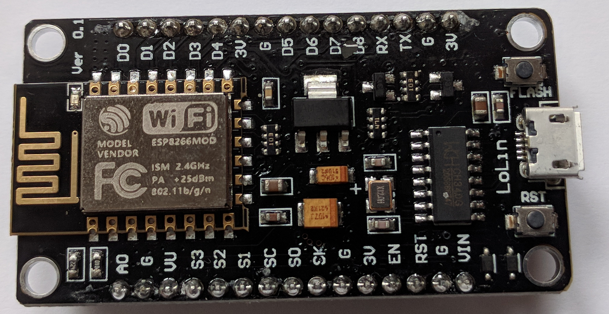

i.e. very much like what we call an "_integrated circuit_". 

Look for instance at what we see when we zoom in the previous picture:

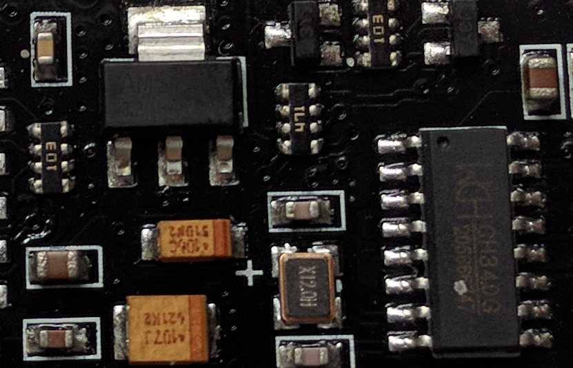

A typical microcontroller includes a processor, memory and input/output (I/O) peripherals.

# What is an ESP8266?

## ESP8266 architecture

An ESP8266 is a microcontroller:

- Low-power, highly-integrated Wi-Fi solution
- A minimum of 7 external components
- Wide temperature range: -40°C to +125°C
- ESP8285 — 8 Mbit flash embedded

_Source_: [https://www.espressif.com/en/products/hardware/esp8266ex/overview](https://www.espressif.com/en/products/hardware/esp8266ex/overview)

Different kind of ESP8266 can be found on the market so your ESP8266 board may differ slightly from the one shown below:

On the picture above, the ESP8266-12 block is where the processor, memory and WIFI unit are located. The rest ensures communication with external sensors, USB port, voltage regulator, etc.

For those interested in computer architecture, have a look at the functional diagram of an ESP8266-12:

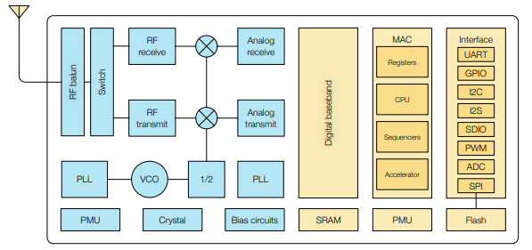

*Source*: [**https://www.espressif.com/sites/default/files/documentation/0a-esp8266ex_datasheet_en.pdf**](https://www.espressif.com/sites/default/files/documentation/0a-esp8266ex_datasheet_en.pdf)

> Become familiar with the ESP8266-12 architecture
>
> On the picture above, can you identify:
> - the CPU (Central Processing Unit)
> - the memory SRAM (Static Random Access Memory)
> 
{: .callout}

The ESP8266 uses a 32bit processor with 16 bit instructions. It is Harvard architecture which mostly means that instruction memory and data memory are completely separate.

The ESP8266 has on die program Read-Only Memory ([ROM](https://en.wikipedia.org/wiki/Read-only_memory)) which includes some library code and a first stage boot loader. All the rest of the code must be stored in external Serial flash memory (provides only serial access to the data - rather than addressing individual bytes, the user reads or writes large contiguous groups of bytes in the address space serially). 

Depending on your ESP8266, the amount of available flash memory can vary.

As any other microcontroller, ESP8266 has a set of GPIO pins (General Purpose Input(Output pins) that we can use to "control" external sensors.

Our ESP8266 has 17 GPIO pins but only 11 can be used (among 17 pins, 6 are used for communication with the on-board flash memory chip). It also has an analog input (to convert a voltage level into a digital value that can be stored and processed in the ESP8266).

It also has a WIFI communication to connect your ESP8266 to your WIFI network, connect to the internet, host a web server, let your smartphone connect to it, etc.

Another advantage of an ESP8266 is that is can be programmed as any other microcontroller and especially any Arduino.

# Why using Arduino GUI?

There are different ways to program the ESP8266 such as [micropython](https://micropython.org/) (a subset of python) or using the [Arduino IDE](https://www.arduino.cc/en/Main/Software). 

In this lesson, we will be using the Arduino IDE as it has a simple interface with built-in examples.

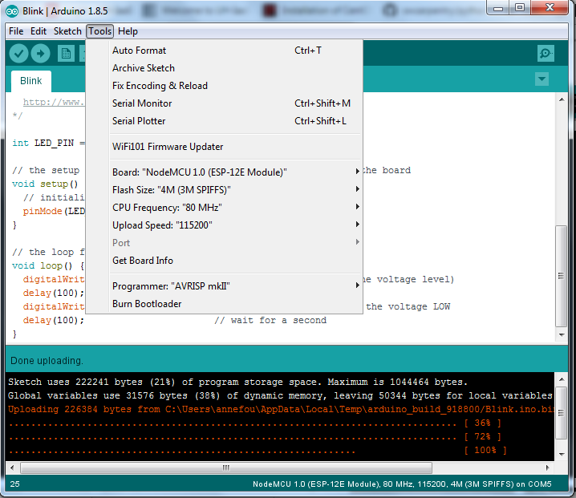

# How to install Arduino Desktop IDE?

1. Download Arduino Desktop IDE at [Arduino Software](https://www.arduino.cc/en/main/software#download) 
2. Choose and click on the corresponding distribution depending on your Operating System (Windows 7, Windows10, Linux 64 bits, etc.)
3. Click on "__JUST DOWNLOAD__" and follow instructions given
4. If you do not have administrator rights, download the "_Windows ZIP file for non admin install_" and unzip it to the desired location.
5. Start Arduino Desktop IDE (if it does not start automatically or you don't find the Arduino IDE shortcut, click on arduino.exe)

# How to program an ESP8266 with Arduino GUI?

## Install support for ESP8266

- Select "File --> Preferences"

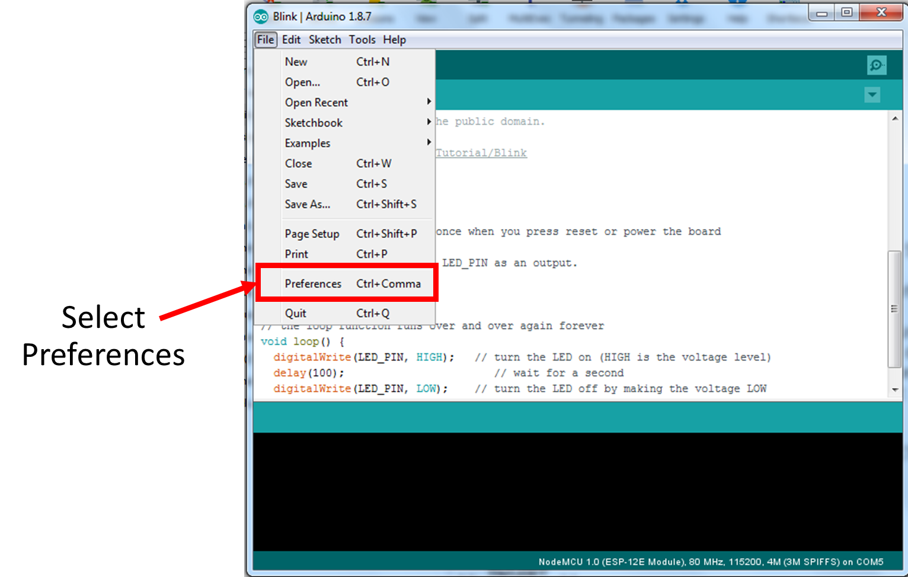

- Add **http://arduino.esp8266.com/stable/package_esp8266com_index.json** to "Additional Boards Manager URLs"

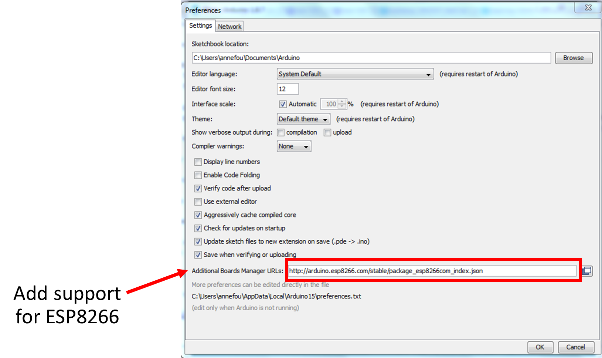

- Click on "OK"

## Verify that the ESP8266 board is recognized

- Connect the micro USB type B side of the cable to the ESP8266 board as shown on the figure below (mind the direction of the connector!)

- Connect the USB type A side of the cable to your computer.
- Open tab "Tools --> Boards --> Boards Manager" and check "NodeMCU 1.0 (ESP-12E Module)" is available. If it is not available, then you also need to install a driver for USB chip; follow instructions given in the next section and go to 4 to continue your installation.
- Select **NodeMCU 1.0 (ESP-12E Module)** board

## Install driver for USB chip (Windows only)

If NodeMCU 1.0 (ESP-12E Module) is not available:

- Click "__Tools --> Board --> Boards Manager__"

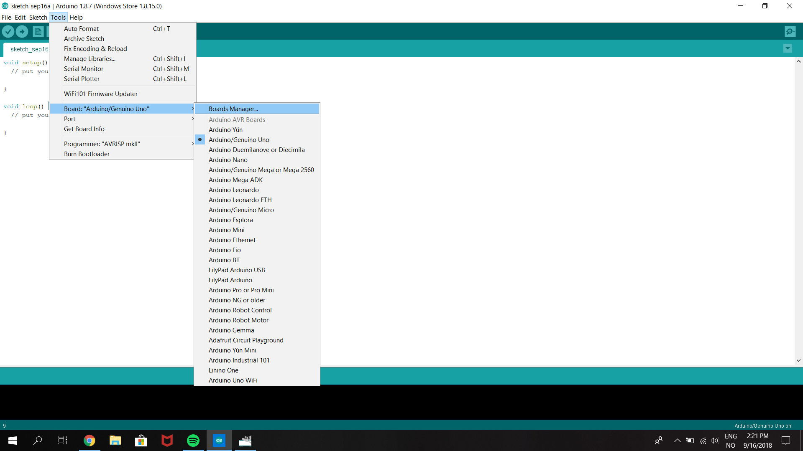

- Enter "__esp8266__" as shown on the figure below

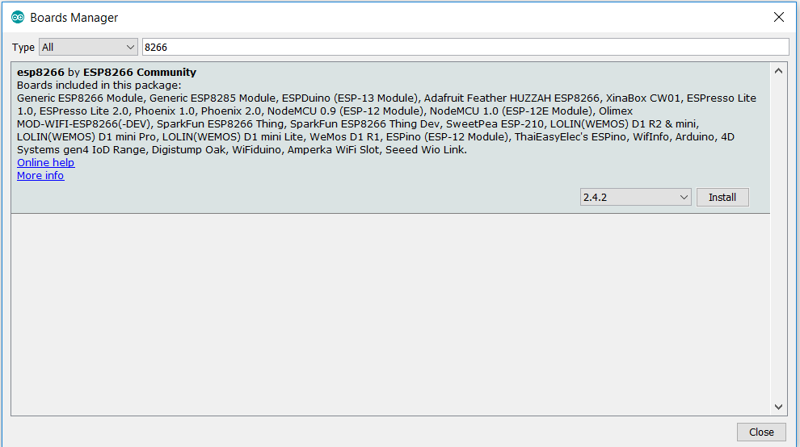

- Click on "__Install__" (this step may take a few minutes)

You should then be able to select "NoneMCU 1.0 (ESP-12E Module)":

- Open tab "Tools --> Boards --> Boards Manager" and check "NodeMCU 1.0 (ESP-12E Module)" is available. If it is not available, then you also need to install a driver for USB chip; follow instructions given in the next section and go to 4 to continue your installation.
- Select **NodeMCU 1.0 (ESP-12E Module)** board

## Select __Port__

Finally you need to select the __port__ (physical USB connector on your computer) to tell the path where the board is physically plugged in your computer.

- Click on "__Tools --> Port__" and select the corresponding USB port.

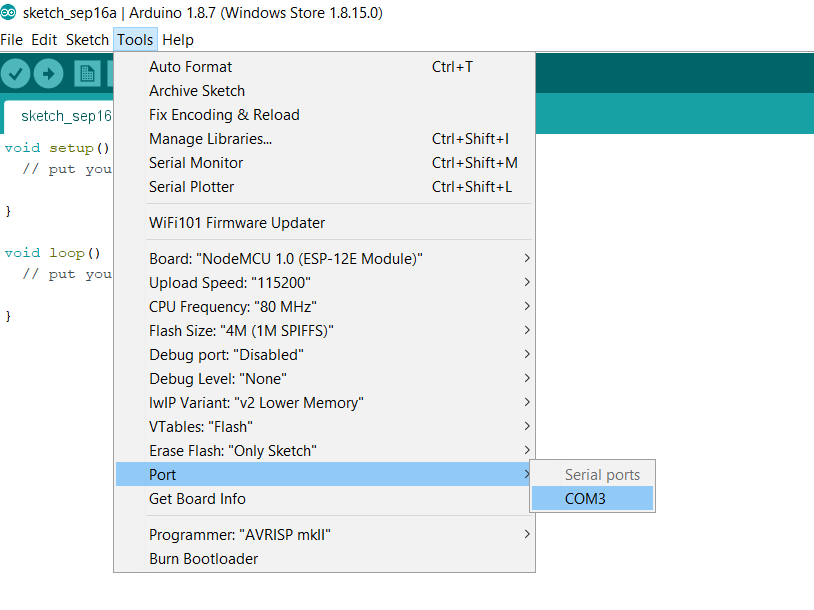

- Check you have selected it: when you click again on "__Tools --> Port__", you should see a "tick" in front of your selected port (see image below):

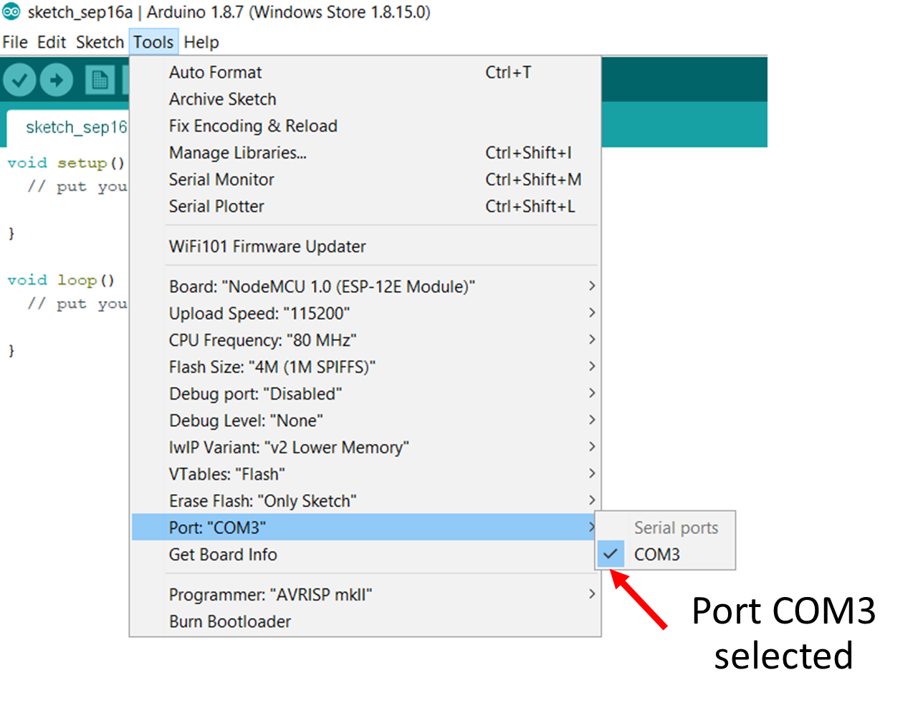

> ## Name of the port
> on a windows computer, ports are name such as "COM3", "COM5", etc. but the naming convention is different on Linux or Mac OSX
>
{: .callout}

## Run our very first program

As our very first program, we will blink the built-in led.

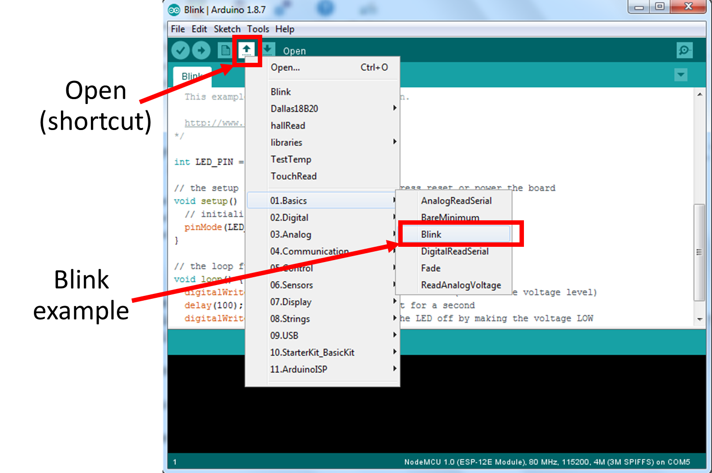

- You should have a code called "Blink" in your Arduino Deskop IDE. 
- Adapt it to ESP8266 i.e. change the variable name **LED_BUILTIN** by **LED_PIN** 
- Define **LED_PIN** variable as an integer and set its value to __2__
- Change the delays (first to 2000 and then 1000):

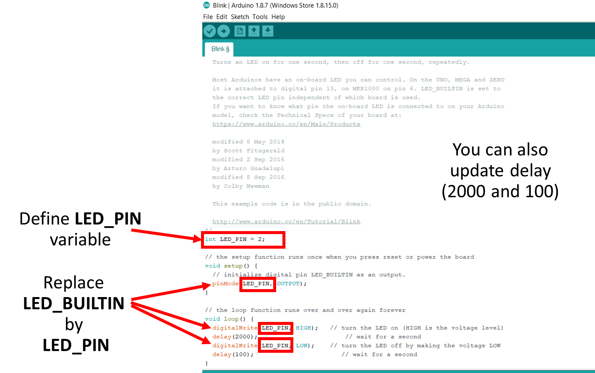

- Try to execute it:

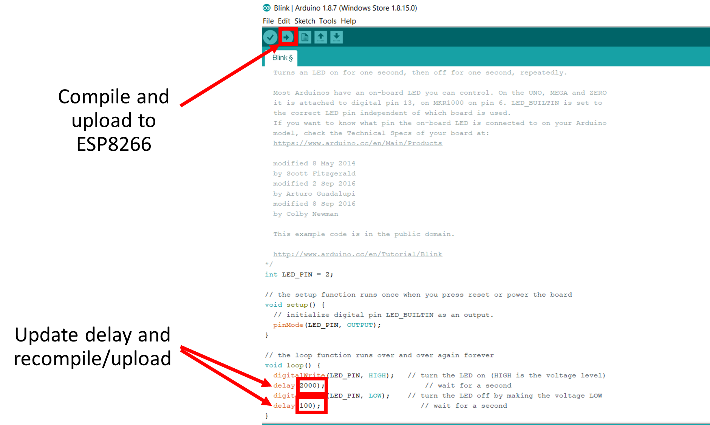

> ## Tips on Arduino Desktop IDE
> 
> 

> 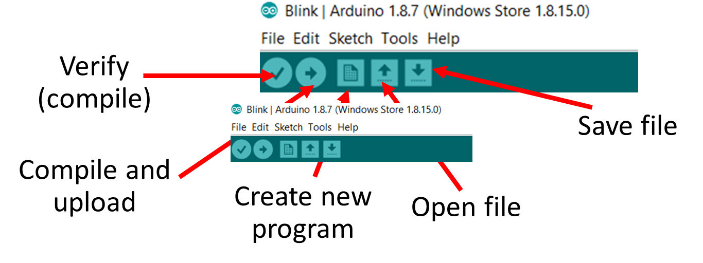     alt="ESP8266-12 blink example"
>          height="250" />
> 

>
{: .callout}

> ## Tips on Arduino IDE language and code structure
> - Comments // (like in C++)
> - setup (void setup()) is executed once only
> - loop (void loop()) is a function that runs forever (quit arduino IDE to stop it).
>
{: .callout}


