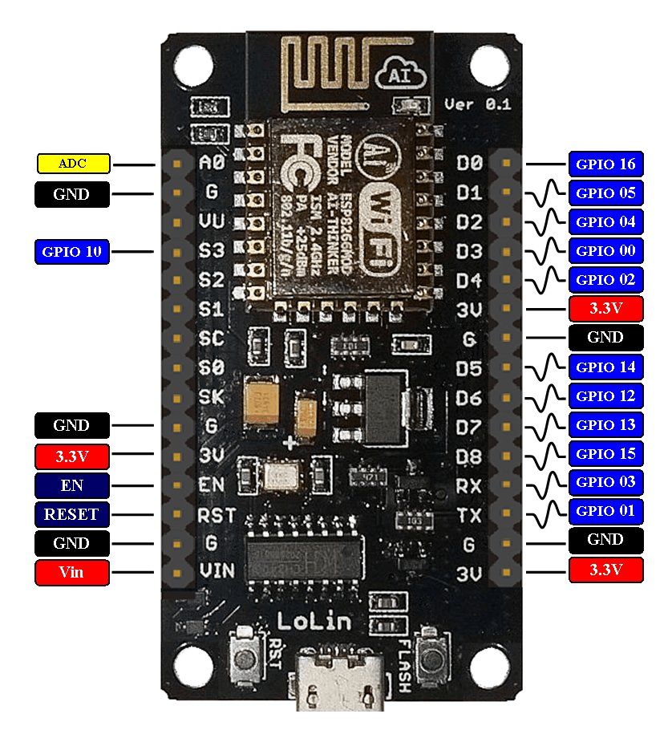
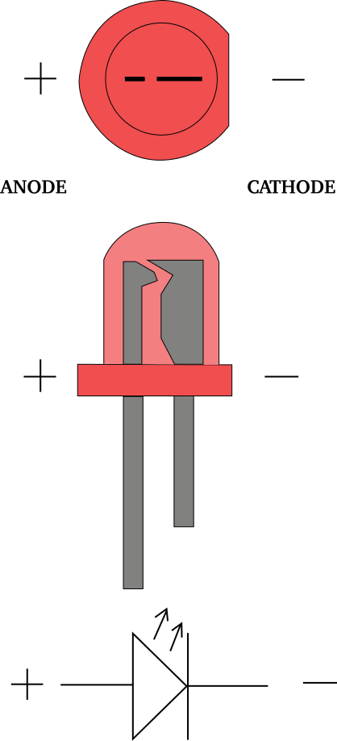
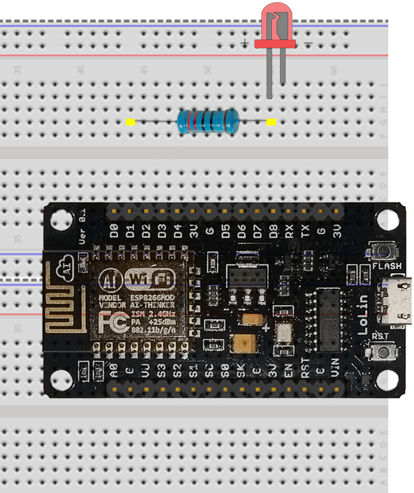
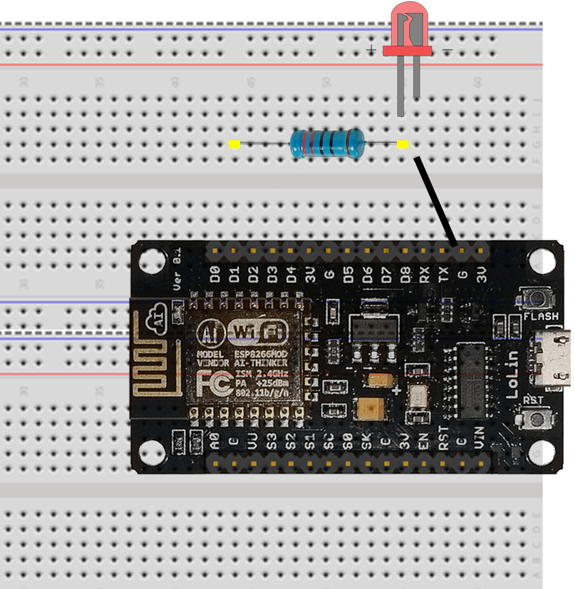
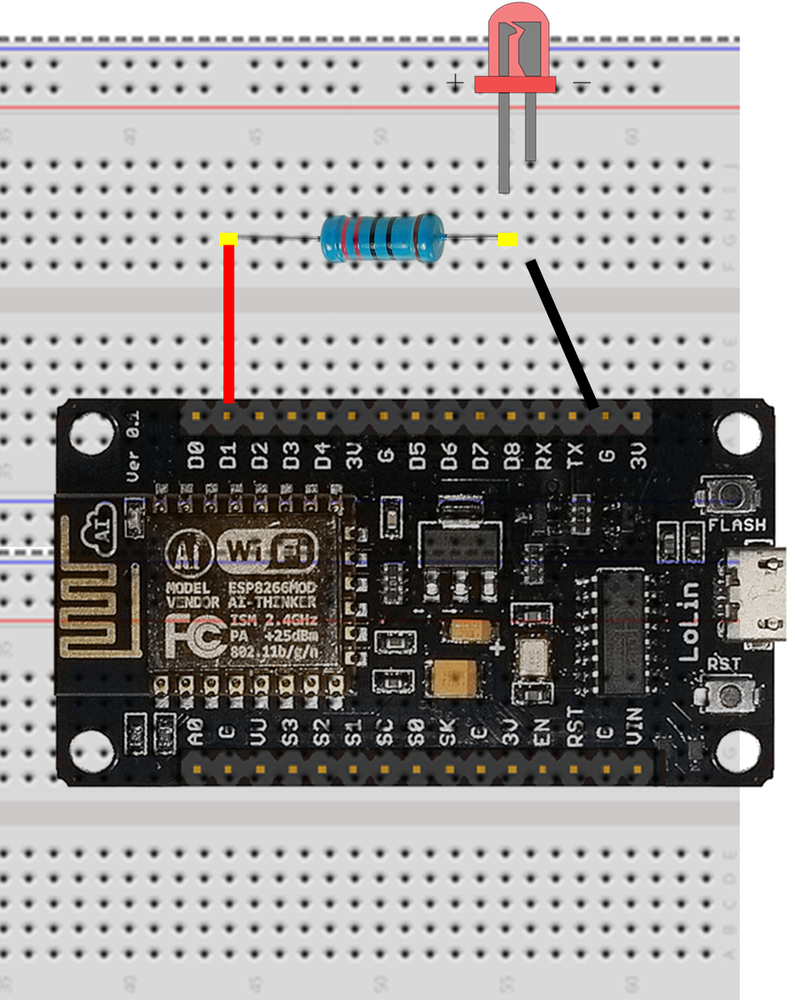
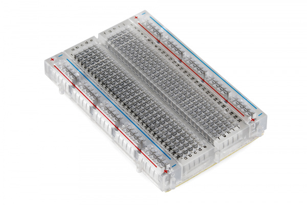
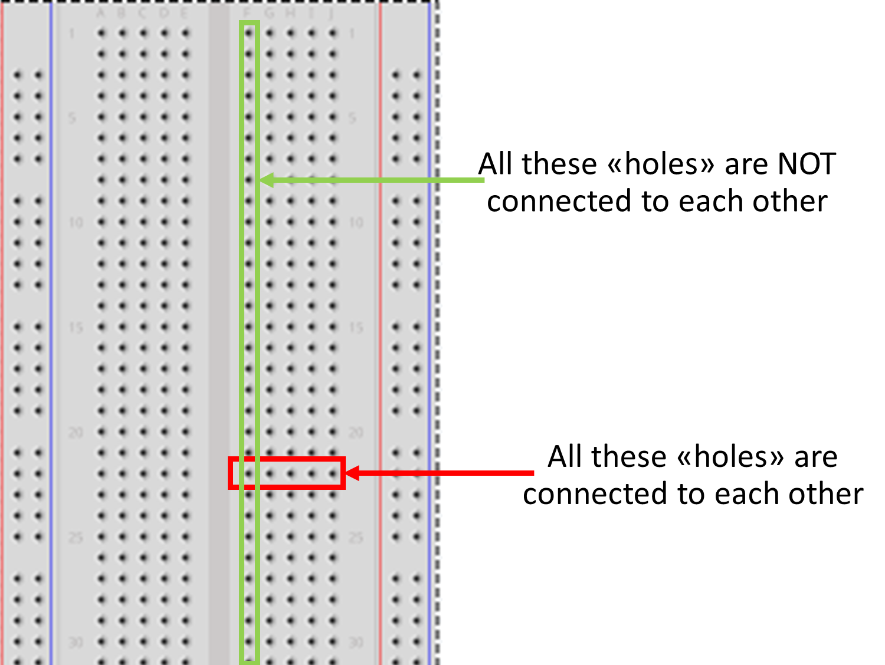

Now that your ESP8266 is fully installed and working on your laptop, we can start to add an external led and control it via a program.

## Using GPIOs of the ESP8266

Before using an available GPIO (General Purpose Input/Output) from our ESP8266 board, let's have a look at them:

- __Vin__ to supply power to the ESP8266 (as a standalone device, without your laptop)
- __GND__ Ground pins all connected together and serve as a 0V reference
- __ADC__ Input for the built-in analog to digital convert (8bits)
- __GPIOXX__ are general purpose digital inputs and outputs pins (some of them can be modulated for outputs)

## LED (light-Emitting Diode)

A LED is an electronic component which glows when a voltage is applied.

**Be careful** the led has to be connected in the correct direction otherwise it will be damaged.

The correct direction is:
- short leg (-) connected to __GND__
- long leg (+) connected to the power supply but not **directly**. A **resistor** must be introduced (in series) in order to limit the maximum current crossing the junction (inside the LED).

In our example, a 220 Ohm will be used (I = U / R = 3.3 / 220 = 0.015 A = 15 mA).

- First **disconnect the ESP8266 from your computer** (disconnect USB).

Use the breadboard and the wires to connect the resistor, the LED and the ESP8266 together as follow:

- Bend (gently) the 2 legs of the resistor (to make a U) and place it on the breadboard on two parallel rows; one of which needs to be inline with the GPIO 5 (D1 on the ESP8266) as shown on the picture

- Place the long leg (+) of the LED in a hole on the same row as the resistor as shown on the figure below.

- Connect the short leg (-) of the LED to the ground (GND) using a black wire as shown on the figure below.

- Connect the first leg of the resistor using a second wire (red) to the GPIO 5 of the ESP8266 (D1).

> ## Tips for the breadboard
>
> Breadboards consist of tiny "holes" in which the leads of the component connect into. 
> 

>       alt="ESP8266-12 GPIOs"
>          height="400" />
> 

> 
> But holes are not all connected to each others.
>
> 

>       alt="breadbord connections"
>          height="400" />
> 

> More information can be found [here](https://learn.sparkfun.com/tutorials/how-to-use-a-breadboard)
>
{: .callout}

**Check your electronic circuit before running your programm**.

## Run your program

- Take your previous Blink code and replace __LED_PIN = 2__ by __LED_PIN = 5__
- Connect your ESP8266 to your computer via the USB port
- Recompile and upload

- You can also change delay (for instance 100 and 2000).

If everything is OK, your LED should blink!


