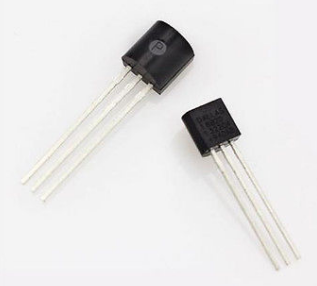
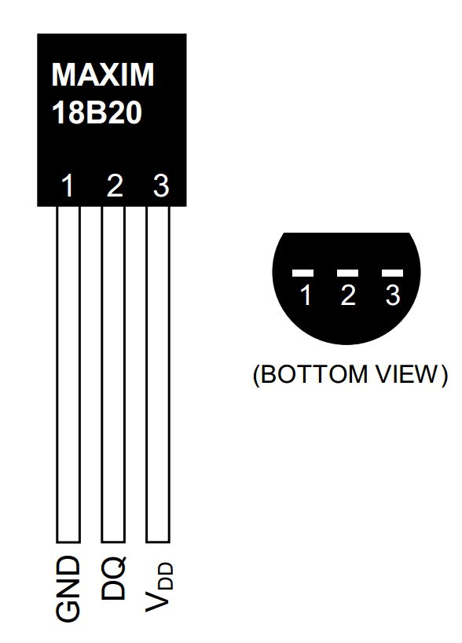
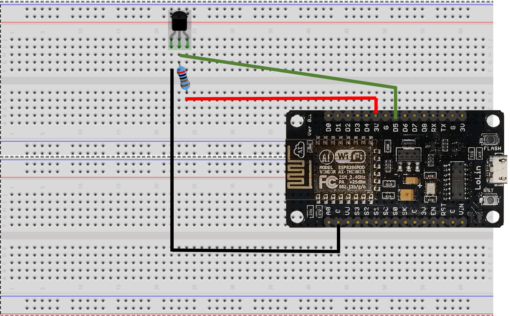
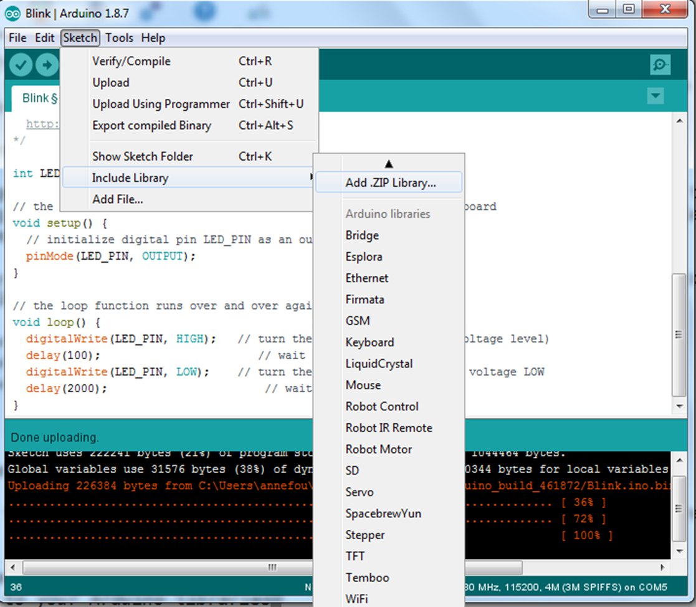
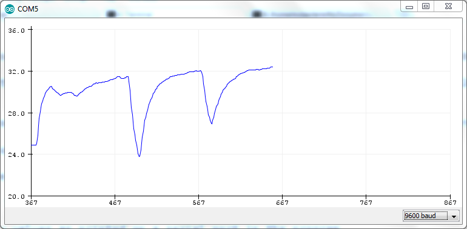

# Dallas DS18b20 thermistor

## DS18b20 information

## Connect a DS18b20 to our ESP8266

We will add our [DS18b20](https://datasheets.maximintegrated.com/en/ds/DS18B20.pdf) to the previous circuit. For now our LED will blink independently from our temperature sensor. Later, we will add a photodiode and switch on the LED at "night".

- First **disconnect** your ESP8266 from your computer

- As for the LED, we need to add a __resistor__ in order to pull down the voltage to 0 and allow the sensor to send a new value.

In our example, a 2.2 kohm will be used.

- Bend (gently) the 2 legs of the resistor (to make a U) and place it on the breadboard with one leg connected to the second leg of the DS18b20 (DQ) and the other leg connected to the last leg of the DS18b20 (VDD).

- Finally connect the first leg of the DS18b20 to the ground (G), the second to 3V and the last to GPIO 14 (D5) as shown on the figure below:

## Get data from your program

In order to acquire data from the DS18b20, you need to install a new library on your computer. 

- Download [OneWire Library](../code/OneWire.zip) on your computer
- Add it to your Arduino libraries (__Sketch --> Include Library --> Add .ZIP library__)

Search in your __Downloads__ folder where your OneWire.zip file was stored and add it.

- Download the [code](../code/DS18b20.ino) to acquire and print data from the DS18b20 thermistor

- Connect your ESP8266 to an USB port on your computer. Check it is recognized properly.

- Compile, upload and execute the code

## Visualize data

- Tools --> Serial Monitor

It will show values as printed on a serial port in the program

- Tools --> Serial Plotter

It will plot the values. Please make sure you first close the __Serial Monitor__ before opening the Serial Plotter (both cannot work together).

In both cases, make sure you select "9600 baud".

# Photodiode 

We will now add a photodiode to the previous circuit and switch on the LED at night only.


